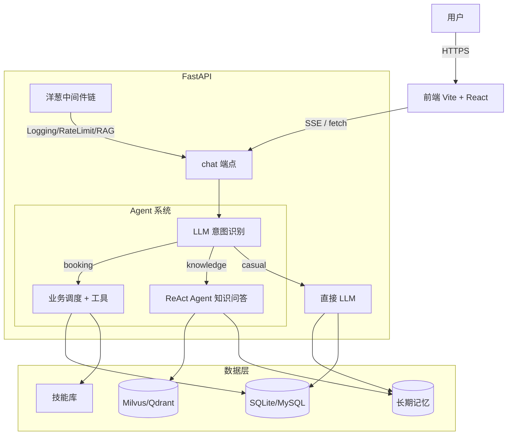

# 美发行业智能预约助手（Hairstylist Booking Agent）

> 面向美发行业 B 端 + C 端双角色 SaaS：
> - **C 端顾客**：用自然语言对话预约（分店/发型师/服务/时间自动引导）
> - **B 端门店**：分店/发型师/服务/订单管理 + 知识库问答

基于 [AgentScope 2.0](https://github.com/agentscope-ai/agentscope) 框架构建，借鉴其 **5 层架构**（数据地基→核心引擎→控制治理→状态持久化→Harness工程）工程化实现。

---

## ✨ 技术亮点（Tech Highlights）

### 🧠 1. LLM 驱动的智能业务流（不是关键词匹配）

| 维度 | 业界常见 | 本项目 |
|------|----------|--------|
| 意图识别 | 关键词匹配（脆弱、易误判） | **LLM 分类器**（booking/knowledge/casual） |
| 业务流 | 硬编码 if-else | Agent 通过 **Tool Calling 自主决策** |
| 模糊输入 | 报错或忽略 | LLM 解析 + 引导（用户说"造型烫"→ 列已有服务选项） |
| 事实提取 | 正则/NLP 规则 | **LLM 从对话抽取** + 注入到下次 system prompt |

### 🏪 2. 完整企业级业务能力

- **多分店 + 距离排序**：Haversine 公式 + 用户经纬度
- **三重冲突检查**：
  1. 门店当日容量（max_daily_appointments）
  2. 发型师当日总时长（max_daily_hours）
  3. 时间段重叠（同一发型师同一天）
- **草稿订单状态机**：draft → pending → confirmed → completed
- **双角色权限**：C 端 / 员工（B 端）
- **手机号+密码+JWT 鉴权**（HS256，7 天过期）

### 🔄 3. AgentScope 5 层架构落地

| 层次 | 实现 | 位置 |
|------|------|------|
| **数据地基** | 消息模型（Msg+ContentBlock）、事件流（28种 AgentEvent） | `app/core/agent_events.py` |
| **核心引擎** | ReAct 循环、Toolkit、MCP 兼容 | AgentScope 2.0 Agent |
| **控制治理** | **5 种中间件洋葱链**（Logging/RateLimit/RAG/Skill/Auth）+ 权限三态 | `app/core/middleware.py`, `app/core/permission.py` |
| **状态持久化** | **AgentStateStore**（JsonFile/Memory 双后端） + safe() 防路径遍历 | `app/core/agent_state_store.py` |
| **Harness 工程** | **技能库**（4 个预置技能 + 关键词匹配） + **长期记忆**（事实提取） | `app/core/skill.py`, `app/core/long_term_memory.py` |

### 🔍 4. 生产级 RAG 引擎

```
bytes → Parser → Section[] → Chunker → Chunk[]
                                      ↓
                          embed → store on collection

search: query → retrieve → parent_id 聚合 → Rerank 精排 → Top-K 父块
```

- **父子分块**（小块检索 + 大块返回）
- **真实 Rerank**（gte-rerank / DashScope）
- **Self-RAG**（无结果/低分/命中少 → 自动重写 query）
- **RAGMiddleware**（在 onReasoning 阶段自动注入 RAG 知识到 system prompt）
- **多租户隔离**（Qdrant + Milvus 双 filter 适配）
- **混合检索可扩展**（向量 + BM25 预留）

### 🛡️ 5. 高可用性

- **错误分类**（transient / rate_limit / permanent）+ 指数退避重试
- **结构化日志**（JSON + trace_id + 上下文注入）
- **生产级健康检查**（`/health` 检查 DB/向量库/LLM，503 区分）
- **Prometheus 指标**（`/metrics`：chat 计数/延迟直方图/LLM 耗时/工具调用/RAG 命中）
- **Alembic 数据库迁移**（支持 schema 演进）
- **Docker + docker-compose**（api + qdrant + milvus 一键启动）
- **SSE 流式响应**（实时推送 Agent 思考/工具调用/选项）
- **HITL 人在回路**（confirm_order / cancel_order 需用户确认）
- **限流**（每用户 120/min）
- **CORS 严格白名单**（生产环境）

### 🧪 6. 完整测试覆盖

```bash
# E2E 一键回归（35+ 断言）
python scripts/e2e_test.py
# 单元测试
pytest tests/ -v
```

---

## 🏗️ 架构图



---

## 📂 项目结构

```
hairstylist-kb-agent/
├── app/
│   ├── server/             # FastAPI 路由
│   │   ├── api.py          # 主端点（chat/orders/branches/skills/permission）
│   │   └── routers/        # 模块化路由
│   ├── core/               # 核心基础设施
│   │   ├── agent_events.py # 28 种事件类型
│   │   ├── agent_state_store.py # 状态持久化（JsonFile/Memory）
│   │   ├── middleware.py   # 洋葱中间件
│   │   ├── permission.py   # HITL 权限三态
│   │   ├── skill.py        # 技能库
│   │   ├── long_term_memory.py # 长期记忆事实提取
│   │   ├── retry.py        # 错误重试
│   │   ├── metrics.py      # Prometheus 指标
│   │   ├── structured_logging.py # JSON 日志
│   │   ├── events.py       # SSE 事件总线
│   │   ├── config.py       # 配置管理
│   │   ├── model_factory.py    # 模型工厂
│   │   └── agent_factory.py    # Agent 工厂
│   ├── db/                 # ORM
│   ├── schemas/            # Pydantic
│   ├── auth/              # JWT
│   ├── agent_tools/        # Agent 工具
│   ├── embedding/          # Embedding + Rerank 适配
│   └── rag/                # RAG 引擎
├── frontend/              # Vite + React + TypeScript
├── alembic/                # 数据库迁移
├── docs/                   # 设计文档 + 长期记忆
├── scripts/                # e2e_test.py + 初始化
├── tests/                  # 单元测试
├── Dockerfile
├── docker-compose.yml
├── .env.example
└── requirements.txt
```

---

## 🚀 快速开始

```bash
# 1. 安装依赖
pip install -r requirements.txt

# 2. 配置
copy .env.example .env       # 填入 API Key

# 3. 数据库迁移
alembic upgrade head

# 4. 启动后端
python -m uvicorn app.server.api:app --host 0.0.0.0 --port 8000

# 5. 启动前端
cd frontend && npm install && npm run dev

# 或 Docker 一键启动
docker-compose up -d
```

## 🧪 端到端测试

```bash
python scripts/e2e_test.py
```

## 📊 监控

- **健康检查**：`GET /health`（检查 DB/向量库/LLM，503 区分）
- **Prometheus**：`GET /metrics`
- **API 文档**：`GET /docs`（Swagger UI）
- **SSE 流式**：`POST /api/chat/stream`

## 🛠️ 技术栈

| 层级 | 技术 |
|------|------|
| Agent 框架 | AgentScope 2.0 (Python) |
| 后端 | FastAPI + SQLAlchemy 2.0 async + Pydantic v2 |
| 数据库 | SQLite (dev) / MySQL (prod) + Alembic |
| 向量库 | Qdrant (dev) / Milvus (prod) |
| 鉴权 | JWT (HS256) + bcrypt |
| 前端 | Vite + React + TypeScript + Tailwind |
| 监控 | Prometheus + 结构化 JSON 日志 |
| 部署 | Docker + docker-compose |
| 测试 | pytest + pytest-asyncio + httpx + E2E 脚本 |
